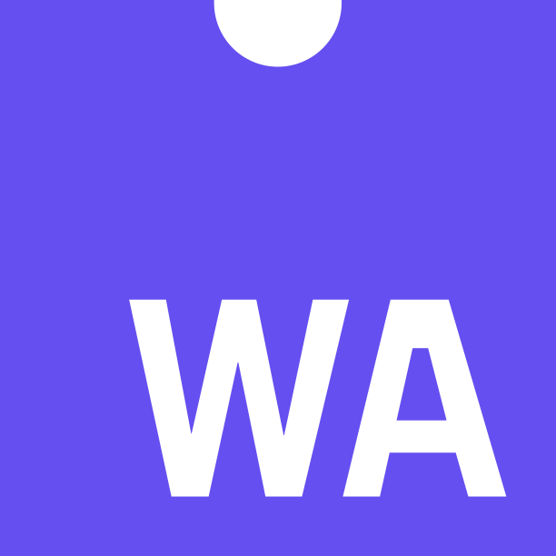

While all of the examples on this website uses the ggsql WebAssembly build to let you run it in the browser, you'll likely want it on your own computer, interfacing with your local data.

ggsql provides native installers for Windows, macOS, and Linux. Choose the best option for your platform below.

::: {#installer-recommended}
<noscript>Download from [GitHub Releases](https://github.com/posit-dev/ggsql/releases)</noscript>
:::

### All platforms

::: {#installer-table}
<noscript>

| Platform | Download | Size |
|----------|----------|------|
| **Windows** | `.exe` | |
| | `.msi` | |
| **macOS** | `.pkg` | |
| **Linux** | `.deb` | |

Download from [GitHub Releases](https://github.com/posit-dev/ggsql/releases)

</noscript>
:::

```{=html}
<script>
(function() {
  const repoOwner = 'posit-dev';
  const repoName = 'ggsql';
  const includePreReleases = true;

  function detectOS() {
    const ua = navigator.userAgent.toLowerCase();
    if (ua.includes('win')) return 'windows';
    if (ua.includes('mac')) return 'macos';
    if (ua.includes('linux')) return 'linux';
    return 'unknown';
  }

  function getOSLabel(os) {
    switch(os) {
      case 'windows': return 'Windows';
      case 'macos': return 'macOS';
      case 'linux': return 'Linux';
      default: return 'your platform';
    }
  }

  function getOSIcon(os) {
    const icons = {
      windows: 'bi-windows',
      macos: 'bi-apple',
      linux: 'bi-ubuntu'
    };
    return icons[os] ? `<i class="bi ${icons[os]}"></i>` : '';
  }

  // Asset matching patterns (CLI only)
  const patterns = {
    windows_exe: /^ggsql[_-]\d.*x64.*-setup\.exe$/i,
    windows_msi: /^ggsql[_-]\d.*x64.*\.msi$/i,
    macos: /^ggsql[_-]\d.*(aarch64|arm64).*\.pkg$/i,
    linux: /^ggsql[_-]\d.*amd64.*\.deb$/i
  };

  function findAsset(assets, pattern) {
    return assets?.find(a => pattern?.test(a.name));
  }

  async function loadInstallers() {
    const recommendedContainer = document.getElementById('installer-recommended');
    const tableContainer = document.getElementById('installer-table');
    if (!recommendedContainer || !tableContainer) return;

    const os = detectOS();

    try {
      const endpoint = includePreReleases
        ? `https://api.github.com/repos/${repoOwner}/${repoName}/releases`
        : `https://api.github.com/repos/${repoOwner}/${repoName}/releases/latest`;
      const response = await fetch(endpoint);
      if (!response.ok) throw new Error('Failed to fetch release');
      const data = await response.json();
      const release = includePreReleases ? data[0] : data;
      if (!release) throw new Error('No releases found');

      const version = release.tag_name;
      const assets = release.assets || [];

      // Find asset for recommended section (current OS)
      let recAsset;
      if (os === 'windows') {
        recAsset = findAsset(assets, patterns.windows_exe);
      } else if (os === 'macos') {
        recAsset = findAsset(assets, patterns.macos);
      } else if (os === 'linux') {
        recAsset = findAsset(assets, patterns.linux);
      }

      // Render recommended section
      recommendedContainer.innerHTML = `
        <a href="${recAsset?.browser_download_url || release.html_url}" class="btn btn-primary install-btn">
          ${getOSIcon(os)} Download ggsql ${version}
        </a>
      `;

      // Find all platform assets
      const winExe = findAsset(assets, patterns.windows_exe);
      const winMsi = findAsset(assets, patterns.windows_msi);
      const mac = findAsset(assets, patterns.macos);
      const linux = findAsset(assets, patterns.linux);

      function formatSize(bytes) {
        if (!bytes) return '';
        const mb = bytes / (1024 * 1024);
        return `${mb.toFixed(1)} MB`;
      }

      function downloadCell(asset) {
        if (!asset) return '<td>—</td><td></td>';
        return `<td><a href="${asset.browser_download_url}">${asset.name}</a></td><td class="size">${formatSize(asset.size)}</td>`;
      }

      // Render table
      tableContainer.innerHTML = `
        <table class="installer-table table">
          <thead>
            <tr>
              <th>Platform</th>
              <th>Download</th>
              <th>Size</th>
            </tr>
          </thead>
          <tbody>
            <tr>
              <td rowspan="2"><strong>Windows</strong></td>
              ${downloadCell(winExe)}
            </tr>
            <tr>
              ${downloadCell(winMsi)}
            </tr>
            <tr>
              <td><strong>macOS</strong></td>
              ${downloadCell(mac)}
            </tr>
            <tr>
              <td><strong>Linux</strong></td>
              ${downloadCell(linux)}
            </tr>
          </tbody>
        </table>
        <p class="installer-note">Version ${version} · <a href="${release.html_url}">View all releases on GitHub</a></p>
      `;
    } catch (e) {
      recommendedContainer.innerHTML = `
        <a href="https://github.com/${repoOwner}/${repoName}/releases" class="btn btn-primary">
          View Downloads on GitHub
        </a>
      `;
      tableContainer.innerHTML = '';
    }
  }

  if (document.readyState === 'loading') {
    document.addEventListener('DOMContentLoaded', loadInstallers);
  } else {
    loadInstallers();
  }
})();
</script>

<style>
#installer-recommended {
  text-align: center;
  margin: 1.5rem 0 2.5rem;
}

#installer-recommended .install-btn {
  min-width: 200px;
  display: inline-flex;
  align-items: center;
  justify-content: center;
  gap: 0.5rem;
}

#installer-recommended .install-btn .bi {
  font-size: 1.5em;
}

.installer-table {
  width: 100%;
  margin: 1rem 0;
}

.installer-table th,
.installer-table td {
  padding: 0.5rem 0.75rem;
  text-align: left;
  vertical-align: middle;
}

.installer-table td.size {
  color: var(--bs-secondary-color, #6c757d);
  font-size: 0.9em;
  white-space: nowrap;
}

.installer-table td a {
  word-break: break-all;
}

.installer-note {
  margin-top: 1rem;
  font-size: 0.9rem;
  opacity: 0.8;
}

.icon-section {
  position: relative;
  padding-left: 5rem;
  margin-top: 5rem
}

/* Quarto's anchor scroll uses a section:target::before pseudo-element
   with negative margin-top to push the section below the fixed navbar.
   That shifts section.top (and thus .icon-section's top) up by the
   navbar height, while <h2> stays in flow — so .section-icons, anchored
   to .icon-section, appears above the heading at anchor view. Override
   the pseudo and use native scroll-margin-top instead. */
.icon-section > section:target::before {
  display: none;
}
.icon-section > section {
  scroll-margin-top: 7rem;
}

.section-icons {
  position: absolute;
  left: 0;
  top: 0.25rem;
  display: flex;
  flex-direction: column;
  gap: 1.5rem;
}
</style>
```


::: {.icon-section}
[{height=60} {height=60}]{.section-icons}

## Jupyter kernel

To use ggsql in Jupyter or Quarto notebooks, install the Jupyter kernel using either `uv` (recommended) or `cargo`. The kernel is also part of the main installer linked to above.

#### Using uv

[uv](https://docs.astral.sh/uv/) is the fastest way to install the binaries:

```bash
uv tool install ggsql-jupyter
ggsql-jupyter --install
```

#### Using cargo

If you have a Rust toolchain installed you can install with cargo:

```bash
cargo install ggsql-jupyter
ggsql-jupyter --install
```
:::

::: {.icon-section}
[{height=60} {height=60}]{.section-icons}

## VS Code / Positron extension

For syntax highlighting and language support in VS Code or Positron, install the ggsql extension. You can either install it directly from the [extension marketplace](https://open-vsx.org/extension/ggsql/ggsql) from within the IDE or download and install it manually (in the *Extensions* view, click the `...` menu, select "Install from VSIX...", and choose the downloaded file.)
:::

::: {.icon-section}
[{height=60} {height=60}]{.section-icons}

## WebAssembly / JavaScript

To use ggsql in a web application or JavaScript environment, you can install the `ggsql-wasm` package from [npm](https://www.npmjs.com/package/ggsql-wasm):

```bash
npm install ggsql-wasm
```

:::
