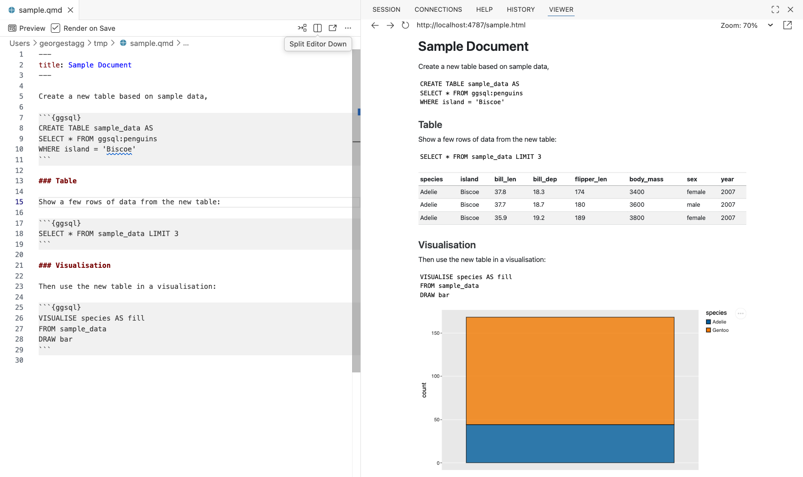
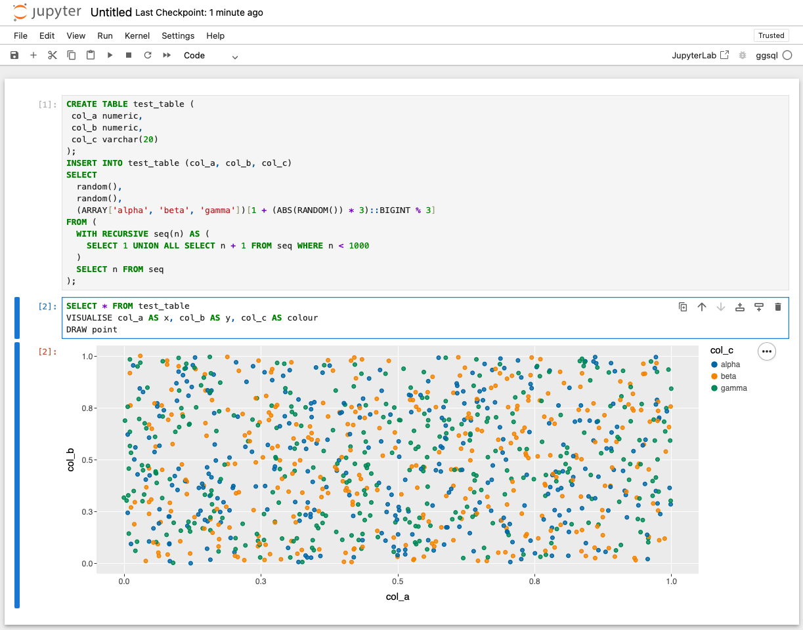
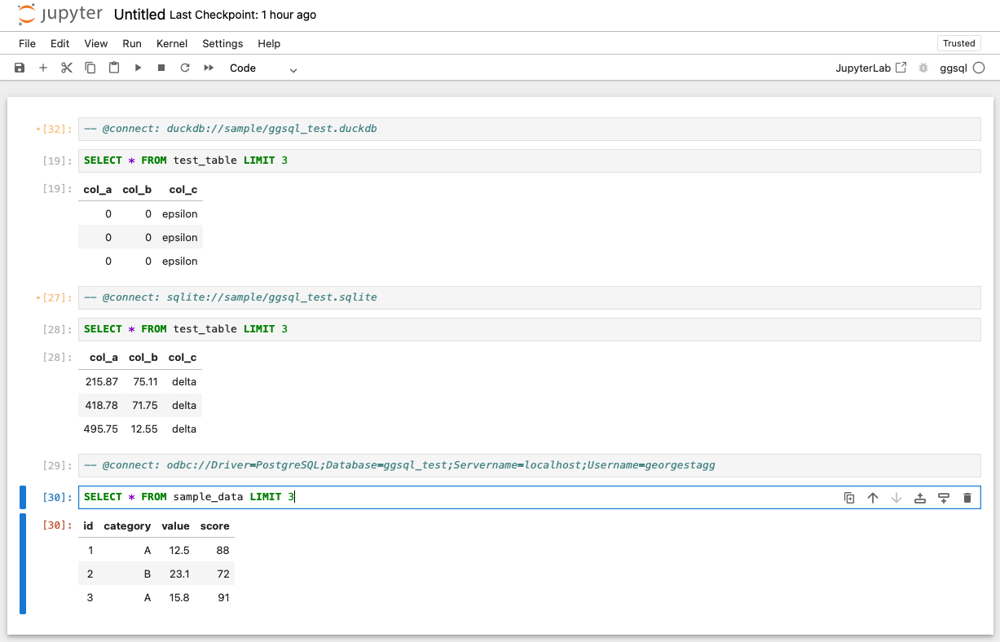

Once the ggsql Jupyter kernel has been installed you can use ggsql in Jupyter notebooks and Quarto documents.

## Installation

First, install ggsql on your system using the Jupyter kernel [installation instructions](../installation.html). If you do not already have Jupyter installed, you should install it in a new virtual environment using [uv](https://docs.astral.sh/uv/) or `pip` first:

```bash
uv venv
uv pip install jupyter
uv pip install ggsql-jupyter
source .venv/bin/activate
ggsql-jupyter --install
```

To verify installation, run `jupyter kernelspec list` and check that `ggsql` is listed as an available kernel.

```bash
$ jupyter kernelspec list
Available kernels:
  python3    /tmp/.venv/share/jupyter/kernels/python3
  ggsql      /home/user/.local/share/jupyter/kernels/ggsql
```

You can now use ggsql in your Quarto documents or Jupyter notebooks.

## Quarto documents

For a Quarto document, use the `ggsql` language name in a code block to tell the renderer to use the ggsql kernel:

````markdown
```{{ggsql}}
VISUALISE species AS fill
FROM ggsql:penguins
DRAW bar
```
````

Each block in the document shares the same session, so tables created in one block will be available in subsequent blocks.



## Jupyter notebooks

First, start a Jupyter notebook server in your terminal:

```bash
jupyter notebook
```

When creating a new notebook, select the ggsql kernel from the kernel selector. Each cell in the notebook can contain a ggsql query, and the resulting visualisation will be displayed inline below the cell.

As with Quarto, each cell in the notebook uses the same session, so tables created in one cell will be available in subsequent cells.



## Database connections

By default, the ggsql kernel starts with an empty in-memory duckdb database connection. A "magic" comment can be used to initiate a different database connection after the session has launched, which can be either a comment in your Quarto code block or invoked directly in a Jupyter notebook cell.

The connection syntax is `-- @connect: [connection_uri]`, where `[connection_uri]` is a ggsql database connection string in the same format as accepted by the [ggsql CLI](cli.html).


